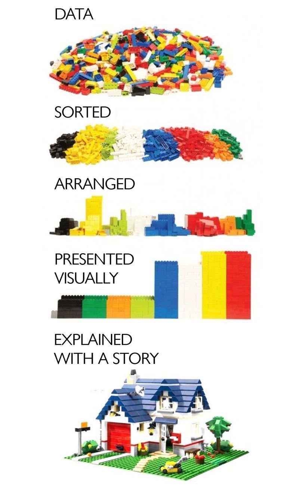
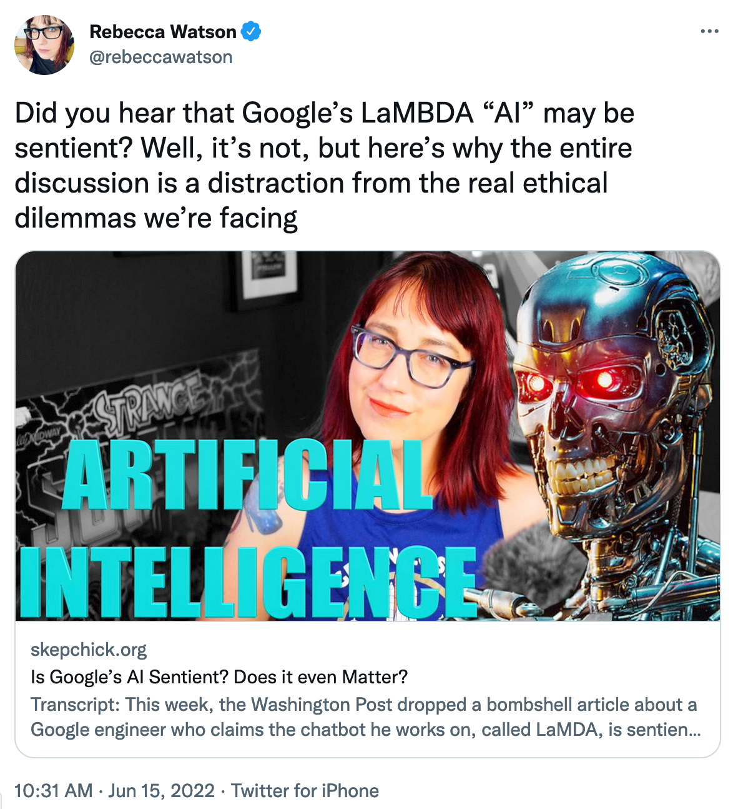
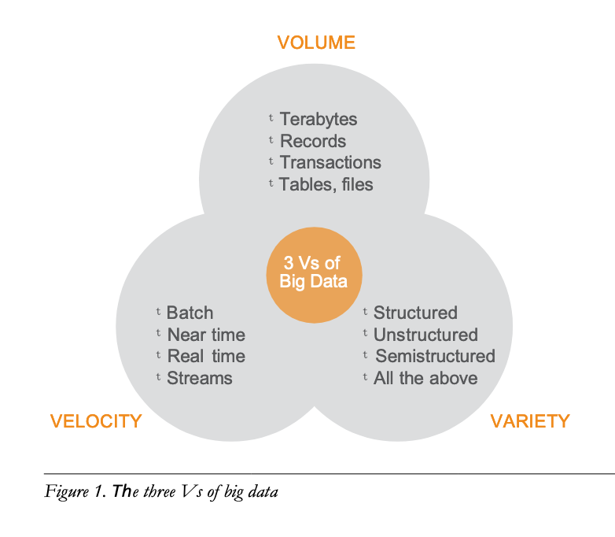
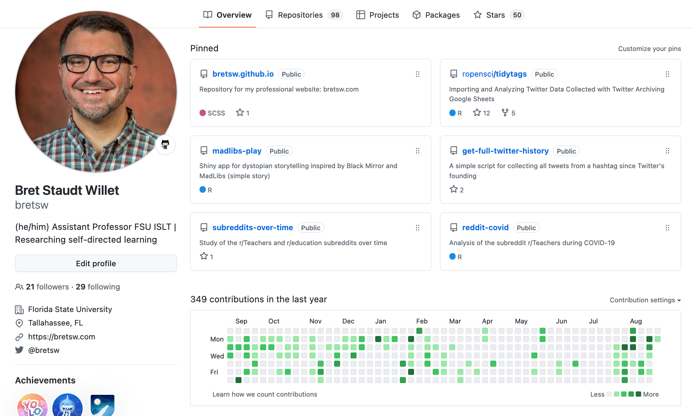
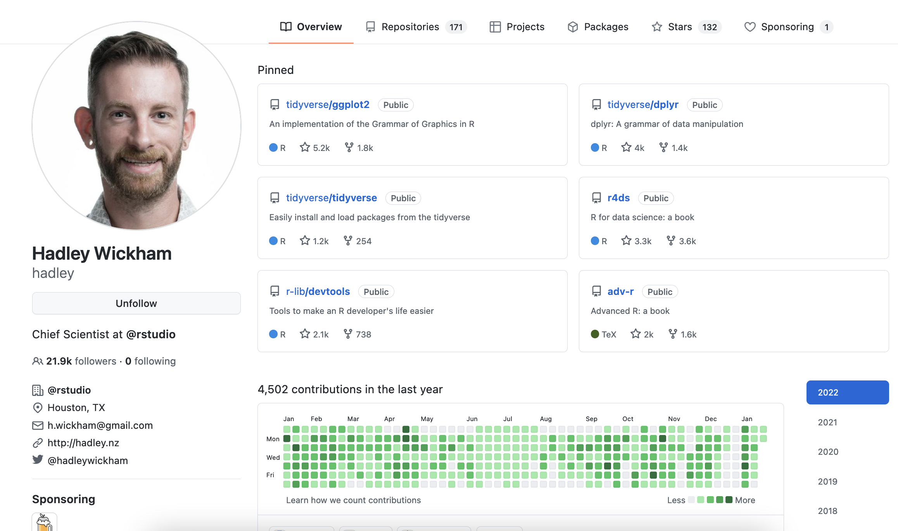
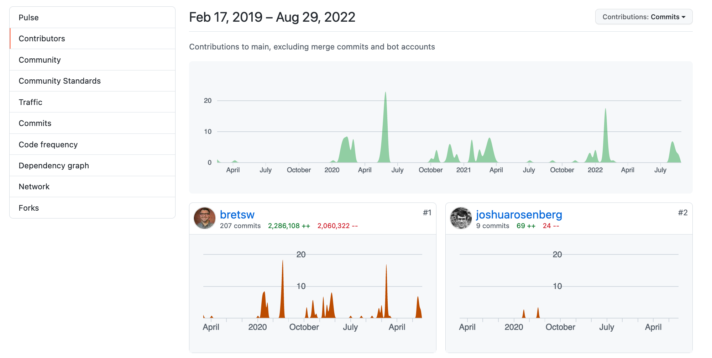
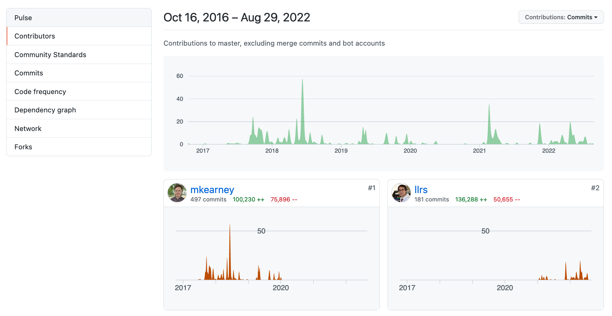
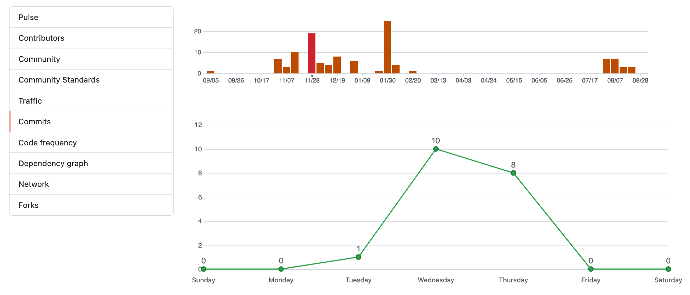
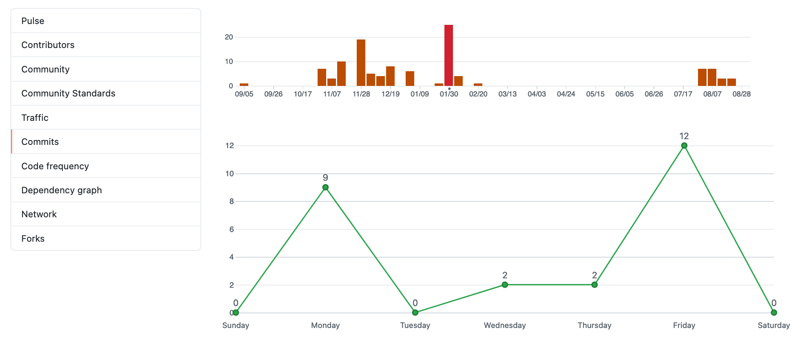

```{r setup, include=FALSE}
usethis::use_git_ignore(c("*.csv", "*.rds"))
options(htmltools.dir.version = FALSE)

library(knitr)
library(tidyverse)
library(xaringan)
library(fontawesome)
```

class: inverse, center, middle

# `r fa("far fa-images", fill = "#fff")`

**View the slides:** 

[bretsw.com/eme6356-ss23-module2](https://bretsw.com/eme6356-ss23-module2)

---

class: inverse, center, middle

# `r fa("fas fa-rss", fill = "#fff")` <br><br> Data Stories

---

# `r fa("fas fa-rss", fill = "#fff")` Data with a story

```{r, out.width = "300px", echo = FALSE, fig.align = "center"}

```

(Tweet from [@alvinfoo](https://twitter.com/alvinfoo/status/1431458670684954629))

---

# `r fa("fas fa-rss", fill = "#fff")` Is LaMBDA AI sentient?

```{r, out.width = "380px", echo = FALSE, fig.align = "center"}

```

(Tweet from [@rebeccawatson](https://twitter.com/rebeccawatson/status/1537080317185433600))

- Initial article on [medium.com](https://cajundiscordian.medium.com/is-lamda-sentient-an-interview-ea64d916d917)
- Read critique at [skepchick.org](https://skepchick.org/2022/06/is-googles-ai-sentient-does-it-even-matter/)
---

class: inverse, center, middle

# `r fa("thumbs-up", fill = "#fff")` <br><br> Looking Back at Module 1

---

# `r fa("thumbs-up", fill = "#fff")` Defining "big data"

```{r, out.width = "540px", echo = FALSE, fig.align = "center"}

```

### The three Vs of big data (Russom, 2011, p. 6)

---

# `r fa("thumbs-up", fill = "#fff")` Optimism about Analytics

```{r, out.width = "360px", echo = FALSE, fig.align = "center"}
include_graphics("img/tools.jpg")
```

--

**Opportunities:**

--

- help decision-making

--

- treat patients

--

- monitor parking

--

- prepare stock in preparation of hurricanes

--

- monitor students’ self-regulated learning, performance, and engagement

---

# `r fa("thumbs-up", fill = "#fff")` Pessimism about Analytics

```{r, out.width = "360px", echo = FALSE, fig.align = "center"}

```

--

**Challenges:**

--

- Misuse of big data, fake news, privacy issues, data security and other ethical considerations
  
--

- Surveillance issues

--

- Leaving digital traces and footprints in online spaces
  
--

- Analytics reports can be lengthy and difficulty to understand

--

- Lack of infrastructure for implementation of analytics in many contexts

---

class: inverse, center, middle

# `r fa("fas fa-question", fill = "#fff")` <br><br> Module 1 <br> Final Thoughts?

---

class: inverse, center, middle

# `r fa("fas fa-arrows-spin", fill = "#fff")` <br><br> Recursive Fun

Q: What is data analytics?

Q: What is performance analytics?

Q: What is learning analytics?

Q: What is web analytics?

Q: What are applications of big data?

Q: Are there any ethical concerns about data analytics?

Q: What should graduate students learn about data analytics?

**https://beta.openai.com/playground/**

---

class: inverse, center, middle

# `r fa("fas fa-arrows-spin", fill = "#fff")` <br><br> Recursive Fun

Q: What is the difference between data analytics and data science?

Q: What is performance analytics?

**https://beta.openai.com/playground/**

---

class: inverse, center, middle

# `r fa("fas fa-arrows-spin", fill = "#fff")` <br><br> Recursive Fun

Q: Who is Bret Staudt Willet?

*Bret Staudt Willet is an American composer, producer, and multi-instrumentalist. He is best known for his work with artists like Kelly Clarkson, P!nk, Rihanna, and Justin Bieber. He has also collaborated with producers such as Dr. Luke, Max Martin, and Zedd. Willet is a three-time Grammy Award winner and has been nominated for multiple awards.*

**https://beta.openai.com/playground/**

---

class: inverse, center, middle

# `r fa("fas fa-chart-line", fill = "#fff")` <br> <br> Module 2: <br> Performance Analytics

---

class: inverse, center, middle

# `r fa("fas fa-chart-line", fill = "#fff")` <br> <br> **Defining Analytics**

---

class: inverse, left, middle

# `r fa("fas fa-chart-line", fill = "#fff")` Analytics:

###

---

class: inverse, left, middle

# `r fa("fas fa-chart-line", fill = "#fff")` Analytics:

### Measure

---

class: inverse, left, middle

# `r fa("fas fa-chart-line", fill = "#fff")` Analytics:

### Measure `r fa("fas fa-arrow-right", fill = "#fff")` Collect

---

class: inverse, left, middle

# `r fa("fas fa-chart-line", fill = "#fff")` Analytics:

### Measure `r fa("fas fa-arrow-right", fill = "#fff")` Collect `r fa("fas fa-arrow-right", fill = "#fff")` Analyze

---

class: inverse, left, middle

# `r fa("fas fa-chart-line", fill = "#fff")` Analytics:

### Measure `r fa("fas fa-arrow-right", fill = "#fff")` Collect `r fa("fas fa-arrow-right", fill = "#fff")` Analyze `r fa("fas fa-arrow-right", fill = "#fff")` Report

---

class: inverse, center, middle

# `r fa("fas fa-chart-line", fill = "#fff")` <br> <br> **Performance at Home**

---

# Performance at Home

```{r, out.width = "480px", echo = FALSE, fig.align = "center"}
include_graphics("img/couch.jpg")
```

Measure `r fa("fas fa-arrow-right", fill = "#782F40")` Collect `r fa("fas fa-arrow-right", fill = "#782F40")` Analyze `r fa("fas fa-arrow-right", fill = "#782F40")` Report

--

**What might we measure?**

---

# Performance at Home

```{r, out.width = "480px", echo = FALSE, fig.align = "center"}
include_graphics("img/couch.jpg")
```

- How has your electricity usage increased due to working from home, if at all?

--

- How have your sleep patterns changed since having a baby?

--

- How has your heart rate changed since starting a new exercise routine?

---

# Performance Analytics Example

### Fitbit

```{r, out.width = "600px", echo = FALSE, fig.align = "center"}
include_graphics("img/6356-icon.jpg")
```

--

**What might we measure?**

---

# Performance Analytics Example

### Fitbit: Daily Steps During COVID-19

```{r, out.width = "720px", echo = FALSE, fig.align = "center"}
include_graphics("img/2-fitbit-daily-steps.png")
```

View the code [on GitHub](https://github.com/bretsw/fitbit)

---

# Performance Analytics Example

### Fitbit: Resting Heart Rate During Move

```{r, out.width = "720px", echo = FALSE, fig.align = "center"}
include_graphics("img/2-fitbit-resting-heart-rate.png")
```

View the code [on GitHub](https://github.com/bretsw/fitbit)

---

# Performance Analytics Example

### Fitbit: Heart Rate Yesterday

```{r, out.width = "720px", echo = FALSE, fig.align = "center"}
include_graphics("img/2-fitbit-heart-rate-yesterday.png")
```

View the code [on GitHub](https://github.com/bretsw/fitbit)

---

class: inverse, center, middle

# `r fa("fas fa-chart-line", fill = "#fff")` <br> <br> **Performance at Work**

---

# Performance at Work

```{r, out.width = "600px", echo = FALSE, fig.align = "center"}
include_graphics("img/workshop.jpg")
```

Measure `r fa("fas fa-arrow-right", fill = "#782F40")` Collect `r fa("fas fa-arrow-right", fill = "#782F40")` Analyze `r fa("fas fa-arrow-right", fill = "#782F40")` Report

--

**What might we measure?**

---

# Performance at Work

```{r, out.width = "600px", echo = FALSE, fig.align = "center"}
include_graphics("img/workshop.jpg")
```

- How has your productivity changed due to working from home, if at all?

--

- Who do you tend to seek for professional advice?

--

- How has the sentiment of team messages changed during COVID-19?

---

# Performance Analytics Example

### GitHub User Profile: @bretsw

```{r, out.width = "720px", echo = FALSE, fig.align = "center"}

```

[View the webpage](https://github.com/bretsw)

---

# Performance Analytics Example

### GitHub User Profile: @hadley

```{r, out.width = "720px", echo = FALSE, fig.align = "center"}

```

[View the webpage](https://github.com/hadley)

---

# Performance Analytics Example

### GitHub: {tidytags} R Package Contributors

```{r, out.width = "100%", echo = FALSE, fig.align = "center"}

```

[View the webpage](https://github.com/bretsw/tidytags/graphs/contributors)

---

# Performance Analytics Example

### GitHub: {rtweet} R Package Contributors

```{r, out.width = "100%", echo = FALSE, fig.align = "center"}

```

[View the webpage](https://github.com/ropensci/rtweet/graphs/contributors)

---

# Performance Analytics Example

### GitHub: {tidytags} Development Timeline (Nov 2021)

```{r, out.width = "100%", echo = FALSE, fig.align = "center"}

```

[View the webpage](https://github.com/bretsw/tidytags/graphs/commit-activity)

Also check out [{tidytags} Code Frequency](https://github.com/bretsw/tidytags/graphs/code-frequency)

---

# Performance Analytics Example

### GitHub: {tidytags} Development Timeline (Jan 2022)

```{r, out.width = "100%", echo = FALSE, fig.align = "center"}

```

[View the webpage](https://github.com/bretsw/tidytags/graphs/commit-activity)

Also check out [{tidytags} Code Frequency](https://github.com/bretsw/tidytags/graphs/code-frequency)

---

class: inverse, center, middle

# `r fa("fas fa-binoculars", fill = "#fff")` <br><br> Looking ahead

---

# `r fa("fas fa-calendar-day", fill = "#fff")` Semester schedule

```{r, out.width = "720px", echo = FALSE, fig.align = "center"}
include_graphics("img/across-time.jpg")
```

- **Module 2:** Performance Analytics
- **Module 3:** Learning Analytics
- **Module 4:** Web Analytics
- **Module 5:** Data Visualization
- **Module 6:** Ethics in Learning Analytics
- **Module 7:** Future of Analytics
- **Module 8:** Case Discussions

---

# `r fa("fas fa-calendar-day", fill = "#fff")` Module structure

```{r, out.width = "480px", echo = FALSE, fig.align = "center"}
include_graphics("img/workshop.jpg")
```

- `r fa("video", fill = "#782F40")` Meet (Wednesdays at 3:05pm EST in Stone #3303)

- `r fa("compass", fill = "#782F40")` Explore

- `r fa("book-open", fill = "#782F40")` Read

- `r fa("comments", fill = "#782F40")` Discuss (in class or on Canvas)

- `r fa("fas fa-keyboard", fill = "#782F40")` Create

---

# `r fa("fas fa-calendar-day", fill = "#fff")` Upcoming Assignments

```{r, out.width = "600px", echo = FALSE, fig.align = "center"}
include_graphics("img/build.jpg")
```

--

### In-Class Discussion (50 points)

--

- Post an idea for in-class discussion on Canvas by Tuesday night

---

# `r fa("fas fa-calendar-day", fill = "#fff")` Upcoming Assignments

```{r, out.width = "360px", echo = FALSE, fig.align = "center"}
include_graphics("img/build.jpg")
```

### Analytics Problem Plan (100 points) - **due end of Module 3**

--

- "Write a brief report (approximately 750-1000 words) identifying and describing a real-world problem that might be addressed via analytics."

--

- "The emphasis of this assignment is on the conceptualization of the problem and the clear identification of a possible data source."

--

- "Then briefly describe how analytics will be used to solve the problem" 

--

- "You will not need to collect actual data related to this problem, just plan for how it would be done."

---

class: inverse, center, middle

# `r fa("fas fa-question", fill = "#fff")` <br><br> Questions

<hr>

**What questions can I answer for you now?**

**How can I support you this week?**

<hr>

`r fa("envelope", fill = "#fff")` [bret.staudtwillet@fsu.edu](mailto:bret.staudtwillet@fsu.edu) | `r fa("globe", fill = "#fff")` [bretsw.com](https://bretsw.com) | `r fa("fab fa-github", fill = "#fff")` [GitHub](https://github.com/bretsw/)